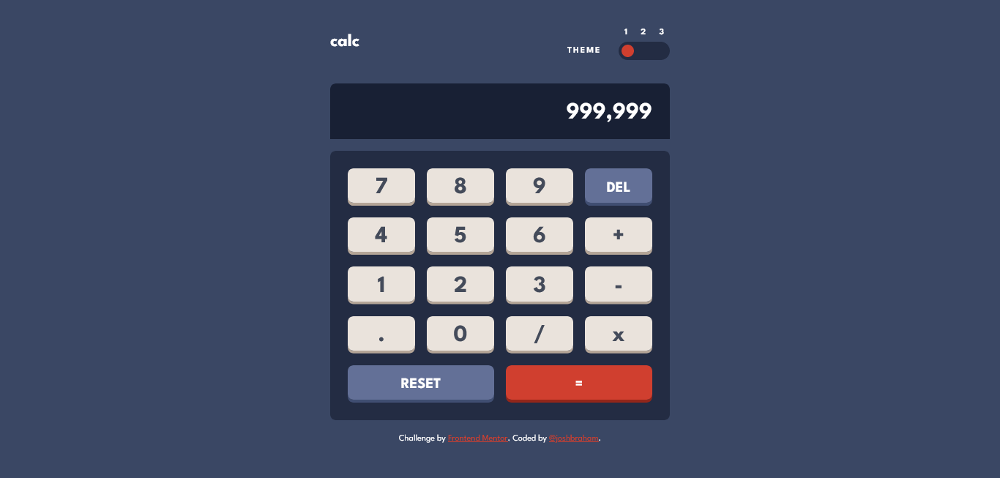

# Frontend Mentor - Calculator app solution

This is a solution to the [Calculator app challenge on Frontend Mentor](https://www.frontendmentor.io/challenges/calculator-app-9lteq5N29)

### [**Live Site Link**](https://jbhm-calculator-app.netlify.app/)

## Overview

### The challenge

Users should be able to:

- See the size of the elements adjust based on their device's screen size
- Perform mathmatical operations like addition, subtraction, multiplication, and division
- Adjust the color theme based on their preference
- **Bonus**: Have their initial theme preference checked using `prefers-color-scheme` and have any additional changes saved in the browser

### Screenshot

## My process

### Built with

- Semantic HTML5 markup
- CSS custom properties
- Flexbox
- CSS Grid
- Mobile-first workflow
- [React](https://reactjs.org/) - JS library

### Useful resources

- [Theme Switcher Tutorial by @KevinPowell](https://www.youtube.com/watch?v=fyuao3G-2qg&ab_channel=KevinPowell) - I was very easily to implement the themes thanks to this.
- [Custom Scrollbar Tutorial](https://www.youtube.com/watch?v=lvKK2fs6h4I&ab_channel=KevinPowell) (also by Kevin) - I wanted to make the calculator screen scrollable in the event of an overflow, but didn't like the clunky default bars. This helped me style them in a manner I thought was more appropriate.

## Author

- Frontend Mentor - [@joshbraham](https://www.frontendmentor.io/profile/joshbraham)
